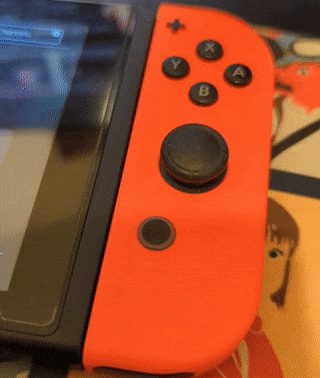

# sys-botbase
A Nintendo Switch (CFW) sys-module that allows users to remote control their switch via sockets as well as read and write to a games memory. This can be used to create bots for games and other fun automation projects.

## Features:
### Remote Control:
- Set controller state
- Simulate buttons press, hold, and release
- Simulate touch screen drawing

### Memory Reading and Writing:
- Read/write x amount bytes of consecutive memory from RAM based on:
    1. Absolute memory address
    2. Address relative to main nso base
    3. Address relative to heap base

### Screen Capture:
- Capture current screen and return as JPG

## Disclaimer:
This project was created for the purpose of development for bot automation. The creators and maintainers of this project are not liable for any damages caused or bans received. Use at your own risk.

## Installation
Download [latest release](https://github.com/olliz0r/sys-botbase/releases/latest) and extract into your Nintendo Switch SD card. Restart your switch. 

When installed correctly, sys-botbase will make your docked joy-con's home button glow on switch bootup. If this does not happen, sys-botbase is not installed correctly.

## Credits
- Big thank you to [jakibaki](https://github.com/jakibaki/sys-netcheat) for a great sysmodule base to learn and work with, as well as being helpful on the Reswitched discord!
- Thanks to RTNX on discord for bringing to my attention a nasty little bug that would very randomly cause RAM poking to go bad and the switch (sometimes) crashing as a result.
- Thanks to Anubis for stress testing!
